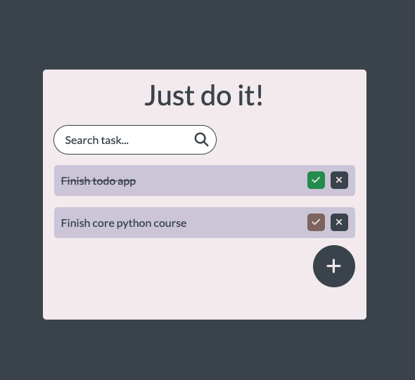

# Project Description

This is a Todo List app built by **Moonlight Kim** from team **_AnB_Prime_**.  

This web app aims to provide a simple yet efficient way to handle everyday tasks.

All features include:

- Create, read, delete and edit todo
- Mark todo as done
- Search todo
- Data persistance with browser's local storage

# Note
I did everything by myself.

# Product screenshot

# Technologies used

- React with Vite build tool.
- Google Font: Lato.
- Font Awesome icons.
- Zustand state manager.
- Browser's local storage.

# Convention Guide

Convention can be accessed [here](/docs/convention.md).

# Other documents

- [Figma](https://www.figma.com/file/jflaJ9DqGFFZQjFrAqiGuG/Todo-List?type=design&node-id=1%3A2&mode=design&t=ceW0VcZrBLtBS2lb-1)
- [User flow](https://docs.google.com/drawings/d/1usat96gk2zrnsOSBH-xhpQY3ApW3xdQOvI5RsJYvQpU/edit?usp=sharing)
